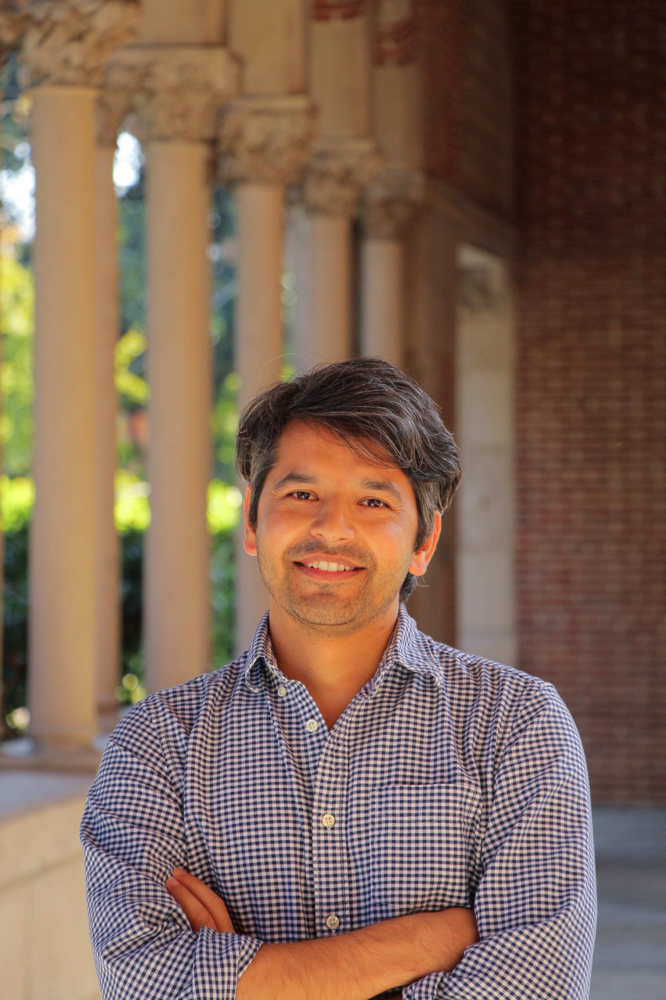

{: style="max-width:180px; float:right; margin-left:20px; border-radius:4px;"}

I am a PhD student in Economics at the University of Southern California (USC), Los Angeles.  
My research interests lie in **political economy**, **development economics**, and **economic history**.

Previously, I worked as a Research Associate at [Governance Lab](https://www.govlab.com.np/ien) in Nepal. I went to **New York University in Abu Dhabi** for my undergraduate studies.

---

## Research Works

### **Published**

- **“[Ancient Nomadic Corridors and Long-run Development in the Highlands of Asia](https://www.sciencedirect.com/science/article/abs/pii/S0014498322000602)”**  
  _Explorations in Economic History 89 (2023): 101482_  [**Lead Article**] with [Christopher Paik](https://christopher-paik.com/)

---

## [Curriculum Vitae](assets/cv/CV.pdf)

---

## Contact

**Email:** kesharsh at usc.edu  
**Affiliation:** Department of Economics, University of Southern California  
